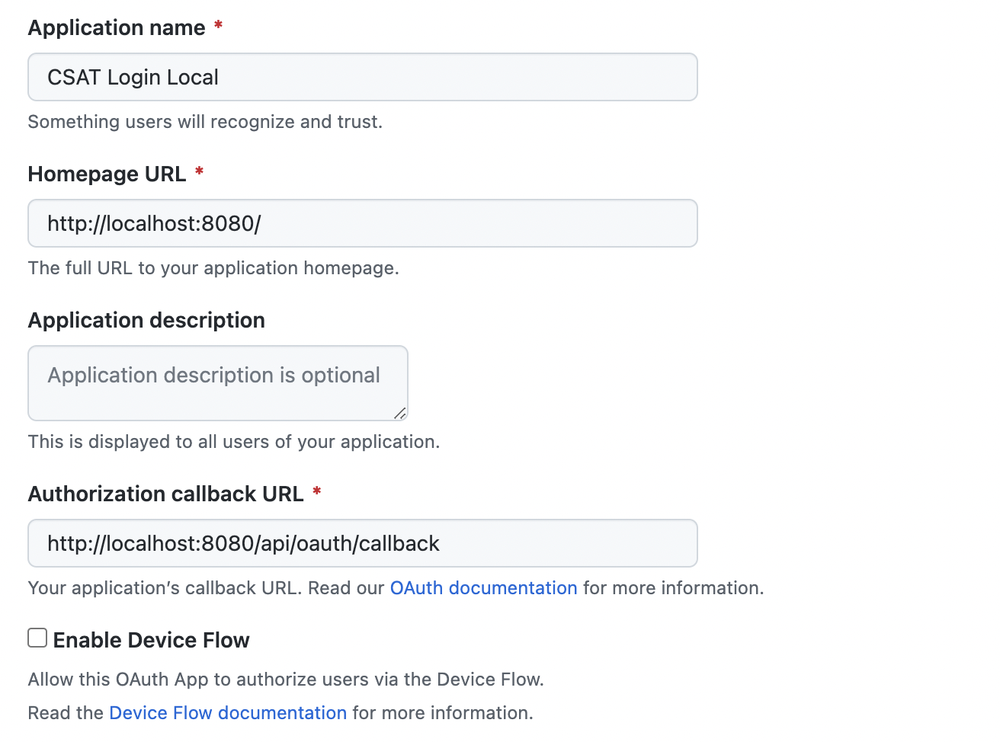

# github-csat

[Current Iteration](https://github.com/orgs/github-csat/projects/1/views/2) | [Next Iteration](https://github.com/orgs/github-csat/projects/1/views/3)

### Setting up a development Environment

Install the deps, create a `kind` cluster -- requires Docker (probably Desktop), and deploy a dev `rqlite` instance.

```shell
make dev-deps
make dev-cluster
make kustomize-deploy-dev
```

RQLite will take a few minutes, to deploy. Run this until you get a response from the HTTP API:

```
make dev-ping-rqlite
```

This just creates a dummy fake table. 
If you run it again, you'll get an error. 
That's all fine, you're just checking to make sure the DB is reachable.

Next, run the fronend vite dev server

```
make run-fe
```

**Note** - the above will open a browser tab at localhost:5713 - ignore this and close it. You'll use
the go server to access the vite dev server via a reverse proxy. (Read on for more)

Now you can run the main go server in another shell

```
make run-be
```

Load the frontend on `http://localhost:8080` (or whatever you set `GIN_ADDRESS` to). You should see a dumb vite dev app.


(**soon**) You can test the frontend/backend/database wiring by visiting `/` - you will see some placeholder and no feedback submissions.

Create a fake submission with

```
make fake-submit
```

and then you can reload `/` or run

```
make fake-query
```

or even

```
make fake-query | tail -n 1 | jq .
```

### Configuring GitHub

Next step is to set up your GitHub credentials so you can test the login flow (there's a `Log In` link on `/` that you can test once this is set up.)

Stop your golang web server (from `make run-be`) and set the following paramters before restarting it

```shell
export GITHUB_CLIENT_ID=
export GITHUB_CLIENT_SECRET=
```

You'll need to generate these from a GitHub application you create, or use the existing `github-csat` or app if you have access to it (you'll still need to create your own client secret).



Once these are set, you can restart your go webserver in the same shell:

```shell
make run-be
```

You may find the video in [PR #36](https://github.com/github-csat/github-csat/pull/36) to be handy to understand what to expect while testing.

### Other Makefile tasks

- `make run-fe` - run the vite dev server
- `make run-be` - run the go server
- `make fmt` - format source files with `go fmt`, `terraform fmt` and `prettier`
- `make vet` - run `go vet`
- `make test-fe-watch` - launch the vitest test runner for frontend
- `make test` - test frontend and backend and exit
- `make fmt-check` - validate formatting and exit without modifying files
- `make ci` - checks used in CI, combination of `make fmt-check`, `make vet`, and `make test`
- `make githooks` - adds `make ci` as a pre-push hook

### RQLITE

Data API: https://github.com/rqlite/rqlite/blob/master/DOC/DATA_API.md#querying-data
Overview Video: https://www.philipotoole.com/rqlite-at-the-cmu-database-group/

### Production stack

- Terraform + Terraform Cloud for orchestration
- GKE autopilot for k8s infrastructure
- Flux2 for CD (bootstrapped in terraform)
- Kustomize for kubernetes manifests
- RQLite for database (for now)
- golang 1.19, w/ [Chainguard base images for production](https://github.com/chainguard-images/images/tree/main/images/go#dockerfile-example)
- GitHub Container Registry for image storage
- Flux SOPS integration for secret management
- GitHub actions for CI/CD
