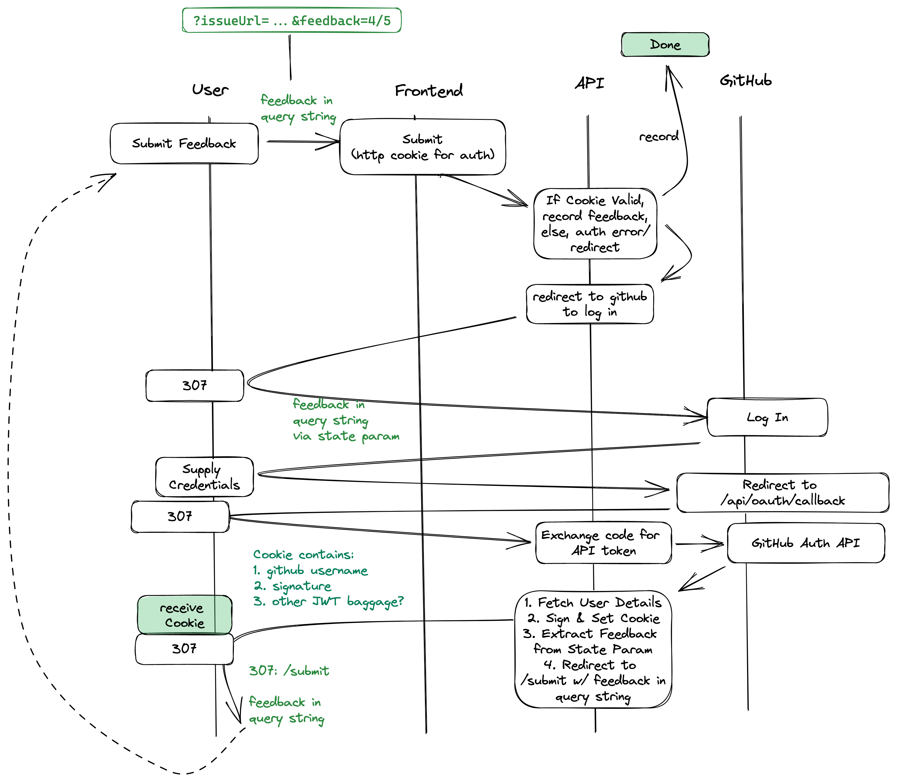

# Login

This document describes the architecture and different flows/corner cases in the
authentication mechanism(s).

## Goals

- Use GitHub auth for login
- /submit attempt is the main / only user entrypoint to the application
- all state on initial /submit pulled all the way through to post-login attempt to /submit
- Stateless sessions w/ JWT - server signs a token that serves as an assertion that an API user is a particular GitHub user
- Store anything sensitive (including signed tokens) in Secure HTTPOnly Cookies with limited path/domain scope
- Cache login state on the frontend using something like localstorage, or maybe a non-httponly cookie

## Diagram

## Words

Note that the above diagram has some aspirational stuff in it still. For example, we don't do anything with localstorage yet.
